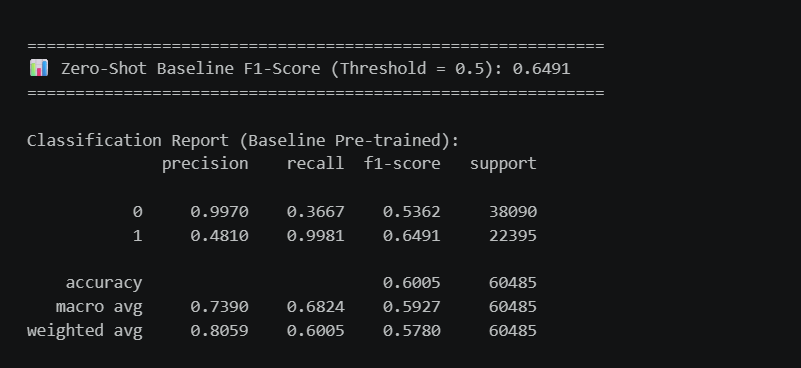

# 🔍 Quora Industrial Semantic Search Engine

### *Production-Grade Two-Stage Semantic Search — Bi-Encoder Retrieval + Cross-Encoder Re-Ranking*
### *محرك بحث دلالي صناعي بمرحلتين — استرجاع بالـ Bi-Encoder وإعادة ترتيب بالـ Cross-Encoder*

<p align="center">
  
  
  
  
  
</p>

<p align="center">
  <a href="https://huggingface.co/spaces/MohamedBelal-AI/quora-semantic-search"><b>🚀 Live Demo</b></a>
  ·
  <a href="#-evaluation--results--النتائج-والتقييم">📊 Evaluation</a>
  ·
  <a href="#-architecture--المعمارية">🏗️ Architecture</a>
  ·
  <a href="#-example-query--مثال-تطبيقي">🔎 Example Query</a>
  ·
  <a href="#-installation--التشغيل">⚙️ Installation</a>
</p>

---

## 📌 Overview | نظرة عامة

**English:**
An end-to-end, industrial-ready **semantic search engine** built on the Quora Question Pairs dataset (~404K pairs). Instead of relying on a single model, the system uses a **Two-Stage Retrieval Architecture** — a fast Bi-Encoder for candidate generation, followed by a precise Cross-Encoder for re-ranking — the same design pattern used in production search systems.

**العربية:**
مشروع **محرك بحث دلالي متكامل وجاهز للإنتاج** مبني على بيانات Quora Question Pairs (حوالي 404 ألف زوج سؤال). بدل الاعتماد على موديل واحد، النظام بيستخدم **معمارية استرجاع بمرحلتين** — Bi-Encoder سريع لتوليد أقرب المرشحين، ثم Cross-Encoder دقيق لإعادة ترتيبهم — وهو نفس التصميم المستخدم في أنظمة البحث الصناعية الحقيقية.

---

## 🏗️ Architecture | المعمارية

```
User Query
    │
    ▼
┌─────────────────────────┐
│   Stage 1: Retrieval     │   Bi-Encoder (fine-tuned all-MiniLM-L6-v2)
│   Bi-Encoder + FAISS     │   → normalized embeddings → IndexFlatIP (Cosine)
│   (fast, top-K candidates)│  → Top-20/30 candidates in ~89 ms
└─────────────┬────────────┘
              │
              ▼
┌─────────────────────────┐
│  Stage 2: Re-Ranking     │   Cross-Encoder (ms-marco-MiniLM-L-6-v2)
│  Cross-Encoder           │   → full attention scoring on candidates
│  (precise, slower)       │   → adds only ~20 ms overhead
└─────────────┬────────────┘
              │
              ▼
     Final Top-K Results
```

---

## 📁 Phase 1: Data Engineering | هندسة البيانات

1. **Load & Explore** — `questions.csv` (404,351 pairs) loaded; class balance checked → 63.08% Non-Duplicate / 36.92% Duplicate.
   تحميل البيانات وفحص توازن الفئات → عدم توازن متوسط بيحتم استخدام F1 بدل Accuracy.
2. **Cleaning** — Missing values, exact + swapped-pair duplicates, URLs/emails/HTML removal → 404,324 final clean rows.
   تنظيف القيم الفارغة، التكرارات المباشرة والمعكوسة، الروابط والإيميلات.
3. **Length Analysis & Outliers** — Filtered to a `[2, 50]` word range, preserving 99.5%+ of the data.
   فلترة أطوال الأسئلة الشاذة مع الحفاظ على أغلب الداتا.
4. **Visualization & Audit** — Word Clouds + before/after class balance check (unchanged at 63.1%/36.9%).
   تصوير بصري وتأكيد إن التنظيف مأثرش على توازن الفئات.

---

## 🔒 Phase 2: Data Splitting & Test Set Isolation | تقسيم البيانات وعزل الاختبار

**English:** A **single, final, stratified split** — 70% Train / 15% Validation / 15% Test — with the Test set's indices **permanently locked** from that point forward. No later step is allowed to re-sample or touch them (verified with programmatic `assert` checks, not a visual review).

**العربية:** **تقسيم واحد نهائي فقط** بنسبة 70% تدريب / 15% تحقق / 15% اختبار، مع قفل أندكسات الاختبار نهائياً بعد كده - بفحص برمجي (`assert`) مش مراجعة بصرية.

---

## 🚀 Phase 3: Bi-Encoder Fine-Tuning & Threshold Calibration | تدريب Bi-Encoder ومعايرة العتبة

### Zero-Shot Baseline | تقييم الموديل الجاهز قبل التدريب
**EN:** Evaluated the raw pretrained `all-MiniLM-L6-v2` before any fine-tuning, at the default threshold (0.5) — proving the raw model over-predicts "duplicate" (Recall 99.8%, Precision only 48%).
**AR:** تقييم الموديل الجاهز قبل التدريب - بيثبت إن الموديل الخام بيصنف كل حاجة تقريباً "متطابقة" عند العتبة الافتراضية.

<p align="center">
  
</p>

### Fine-Tuning + Threshold Calibration | التدريب ومعايرة العتبة
**EN:** Fine-tuned with `OnlineContrastiveLoss` on the **Train set only**, then swept cosine thresholds (0.10→0.90) on Validation to find τ\* = 0.79 — instead of guessing a fixed number.
**AR:** تدريب بـ `OnlineContrastiveLoss` على التدريب بس، ثم معايرة أفضل Threshold على الـ Validation بدل رقم عشوائي.

<p align="center">
  
</p>

**Baseline → Fine-Tuned Improvement | التحسّن بعد التدريب:**

| Metric | Zero-Shot Baseline | Fine-Tuned @ τ*=0.79 |
|---|---|---|
| F1-Score | 0.6491 | **0.8302** |
| Accuracy | 60.05% | **86.32%** |
| Precision | 0.4810 | **0.7680** |

---

## 🏗️ Phase 4: Retrieval Infrastructure & Two-Stage Search | البنية التحتية للاسترجاع

**EN:** Built a searchable Knowledge Base (>300K unique questions) from **Train + Validation only** (Test excluded). Embeddings normalized (`faiss.normalize_L2`) so `IndexFlatIP` becomes mathematically equivalent to Cosine Similarity, followed by Cross-Encoder re-ranking of the top candidates.

**AR:** بناء قاعدة معرفية قابلة للبحث من التدريب والتحقق بس (الاختبار مستبعد). توحيد المتجهات عشان الفهرس يبقى مكافئ رياضياً للـ Cosine، وبعدين إعادة ترتيب المرشحين بالـ Cross-Encoder.

**Latency | زمن الاستجابة:** Stage 1 ≈ 89ms + Stage 2 ≈ 20ms = **~108ms end-to-end** (well within real-time search SLAs).

---

## 📊 Phase 5: Evaluation & Results | النتائج والتقييم

**English:** All metrics reported on the **fully isolated Test Set**, with automated leakage assertions confirming zero overlap across Train/Validation/Test.

**العربية:** كل المقاييس على **مجموعة اختبار معزولة تماماً**، مع فحص برمجي مؤكد لعدم وجود أي تقاطع بين المجموعات.

### Confusion Matrix (Test Set @ τ=0.79) | مصفوفة الالتباس

<p align="center">
  
</p>

### Retrieval Metrics — Hit Rate@K & MRR@K | مقاييس الاسترجاع

**EN:** Sampled 1,000 duplicate pairs and ran the full two-stage pipeline to measure **end-to-end search quality** (not just pairwise classification).
**AR:** عينة 1000 زوج متطابق شُغّلت على الـ Pipeline كامل لقياس **جودة البحث الفعلية**.

<p align="center">
  
</p>

**Interpretation | التفسير:** The gap between high pairwise F1 (0.83) and lower Hit Rate@1 (5.2%) reflects the difference between "classify a given pair" (easier) and "find the right answer among 300K+ candidates and rank it first" (harder) — a retrieval challenge, not a classification one.
الفرق بين F1 العالي للتصنيف الثنائي والـ Hit Rate@1 المنخفض بيوضح إن "تصنيف زوج محدد" أسهل بكتير من "إيجاد الإجابة الصح وسط 300 ألف مرشح ووضعها في المركز الأول".

---

## 🖥️ Live Demo | التجربة الحية

🔗 **[huggingface.co/spaces/MohamedBelal-AI/quora-semantic-search](https://huggingface.co/spaces/MohamedBelal-AI/quora-semantic-search)**

<p align="center">
  
</p>

### 🔎 Example Query | مثال تطبيقي

**Query:** `"How can I start learning machine learning from scratch?"`

<p align="center">
  
</p>

**English:** Notice the confidence drop between rank 3 (2.31) and rank 4 (1.57) — the model expresses genuine relevance separation instead of flat, undifferentiated scores. Also note rank 1 ("kevin murphy how do i learn machine learning from scratch") — the model correctly ignored an irrelevant proper noun embedded in the real Quora question, ranking it top purely on semantic similarity of the rest of the sentence.

**العربية:** لاحظ الهبوط الواضح في الثقة بين الترتيب 3 والترتيب 4 - دليل على تمييز دلالي حقيقي مش سكورات متقاربة بلا معنى. كمان لاحظ النتيجة الأولى ("kevin murphy...") - الموديل قدر يتجاهل اسم علم مش له علاقة بالسؤال داخل سؤال Quora حقيقي، ورتّبها الأولى بناءً على التشابه الدلالي لباقي الجملة بس.

---

## 🚀 Deployment | النشر

1. **Save Artifacts** — fine-tuned model, FAISS index, Knowledge Base question list, and a `config.json` with the calibrated threshold + metrics.
   حفظ الموديل، فهرس FAISS، قايمة الأسئلة، وملف إعدادات فيه العتبة المعايرة.
2. **`requirements.txt`** — full runtime dependencies (`fastapi`, `uvicorn`, `pydantic`, `sentence-transformers`, `faiss-cpu`, `torch`, `gradio`).
   توثيق كل المكتبات المطلوبة فعلياً وقت التشغيل.
3. **`app.py`** — standalone Gradio interface with adjustable Top-K sliders, loading all artifacts once at startup.
   واجهة Gradio مستقلة بتحمّل كل المخرجات مرة واحدة عند التشغيل.
4. **Upload to Hugging Face Spaces** via the `huggingface_hub` API — deployed to a permanent, always-on public URL.
   رفع فعلي على Hugging Face Spaces برابط دائم شغال 24/7.

---

## ⚙️ Tech Stack | الأدوات المستخدمة

| Category | Tools |
|---|---|
| Modeling | `sentence-transformers`, `PyTorch` |
| Vector Search | `FAISS` (IndexFlatIP) |
| Re-Ranking | Cross-Encoder (`ms-marco-MiniLM-L-6-v2`) |
| Serving | `FastAPI`, `Gradio`, `Uvicorn`, `Pydantic` |
| Deployment | Hugging Face Spaces |
| Data Processing | `pandas`, `NumPy`, `scikit-learn` |
| Visualization | `matplotlib`, `seaborn`, `wordcloud` |

---

## 📁 Dataset | البيانات

**English:** [Quora Question Pairs](https://www.kaggle.com/c/quora-question-pairs) — 404,351 question pairs, split 70% Train / 15% Validation / 15% Test (stratified, leak-free).

**العربية:** بيانات [Quora Question Pairs](https://www.kaggle.com/c/quora-question-pairs) — 404,351 زوج سؤال، مقسّمة 70%/15%/15% بدون أي تسريب بيانات.

---

## ⚙️ Installation | التشغيل

```bash
git clone <repo-url>
cd quora-semantic-search
pip install -r requirements.txt
python app.py
```

---

## 🧾 Summary | الخلاصة

**EN:** A complete, methodologically sound ML lifecycle: cleaning → leak-free splitting → baseline comparison → fine-tuning → threshold calibration → two-stage retrieval architecture → multi-angle evaluation (classification + retrieval + latency) → real deployment.

**AR:** دورة حياة مشروع Machine Learning كاملة ومنهجياً سليمة: تنظيف ← تقسيم بدون تسريب ← مقارنة Baseline ← تدريب ← معايرة عتبة ← معمارية استرجاع بمرحلتين ← تقييم متعدد الجوانب ← نشر حقيقي.

---

## 👤 Author | المطور

**Eng. Mohamed Belal**
Data Science & AI Diploma — Delta Technological University

---

## 📜 License | الترخيص

This project is released under the MIT License.
هذا المشروع منشور تحت رخصة MIT.
